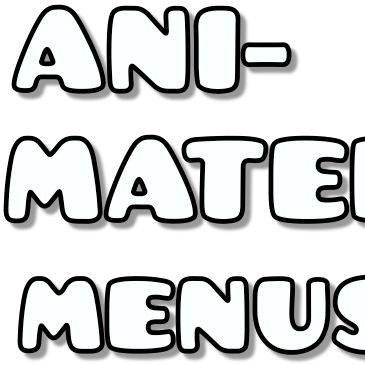

Ever saw how _bland_ the menus are? Have you ever thought how would it look like if they were animated? WELL WORRY NO MORE. I have (an extension of [Main Menu Plus](https://geode-sdk.org/mods/bluescratch.main_menu_plus
))-
# Animated Menus

A Mod Which Animates GD's Menus

NOTICE: THIS MOD IS IN BETA AND BARELY ANIMATES ANY MENUS. MORE MENUS WILL BE SUPPORTED IN HIGHER VERSIONS